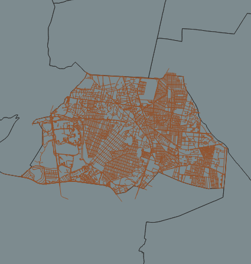
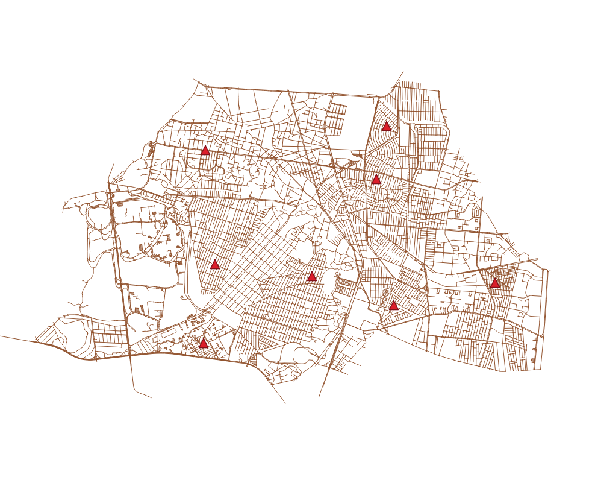
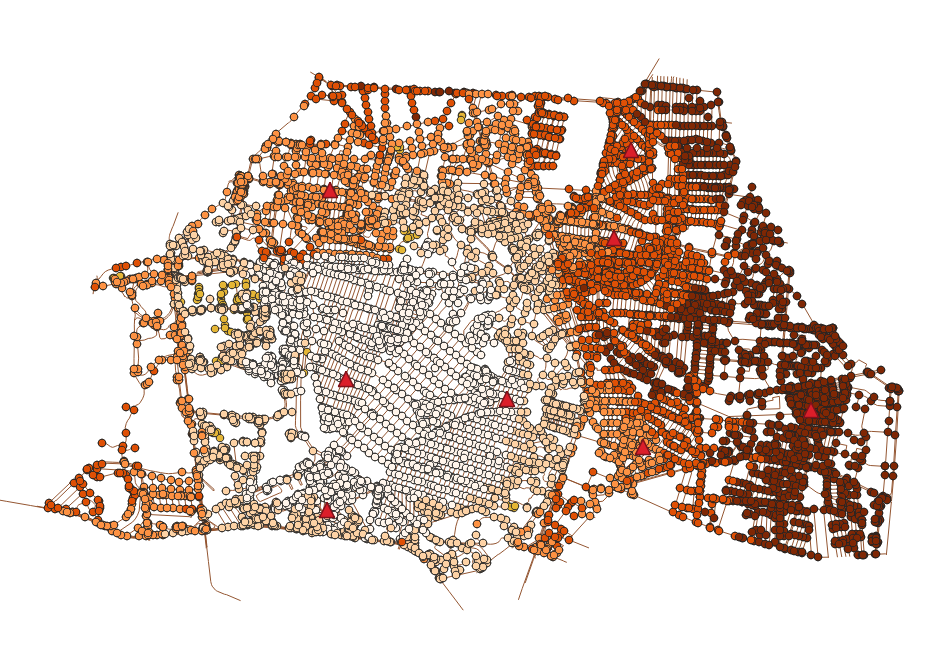
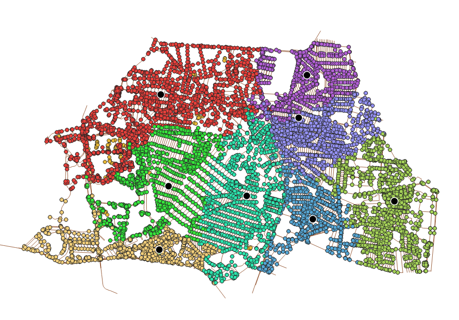
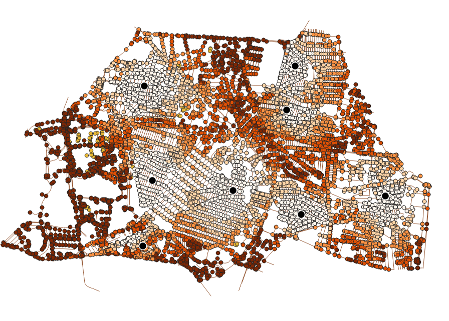

# Modelos de accesibilidad

En esta práctica vamos a desarrollar un modelo de de accesibilidad que vincule a cada nodo de la red con una medida de su accesibilidad a un conjunto de _facilidades_. En principio, lo que vamos a hacer es calcular la distancia (o costo generalizado) entre cada una de las _facilidades_ de origen y todos los nodos de la red, esta será la accesibilidad base, después podremos modoficar esta accesibilidad ya sea modificando el estado de la red o agregando características a los nodos de origen y destino.

Para esta práctica vamos a trabajar con la misma red de calles de OpenStreetMap que en la práctica 6, sin embargo, dado que el problema del cálculo de distancias escala con la cantidad de nodos, vamos a utilizar un recorte de la red a alguna de las alcaldías de la CDMX, por ejemplo la alcaldía Coyoacán. Entonces, para facilitar las consultas de aquía en adelante, vamos a crear una tabla con la red de calles para dicha alcladía (además vamos a indexar las columnas relevantes, para agilizar las operaciones).

````sql
CREATE TABLE ways_coyoacan AS 
SELECT * 
FROM ways_car c, alcaldias a 
WHERE st_intersects(c.the_geom, a.geom) AND a.cvegeo = '09003';

CREATE INDEX red_coyo_geom_idx
  ON ways_coyoacan
  USING GIST (the_geom);

CREATE index red_coyo_source_idx ON ways_coyoacan (source);
CREATE index red_coyo_target_idx ON ways_coyoacan (target);

````

También vamos a hacer una tabla con los nodos de la red que están dentro de la misma alcaldía

````sql
CREATE TABLE  nodos_coyoacan AS
SELECT v.* 
FROM ways_vertices_pgr AS v, alcaldias AS a
WHERE v.id IN (SELECT DISTINCT id FROM ways_vertices_car_pgr)
AND st_intersects(v.the_geom, a.geom)
AND a.cvegeo = '09003';

CREATE INDEX nodos_coyoacan_geom_idx
  ON nodos_coyoacan
  USING GIST (the_geom);

CREATE index nodos_coyoacan_id_idx ON nodos_coyoacan (id);

````




Ahora debemos crear una capa con algunos puntos que representarán nuestros orígenes para el cálculo de accesibilidad. En mi caso tengo una tabla que se llama `bodegas` con 8 puntos repartidos en la alcaldía.



El primer paso, igual que en la práctica anterior, es crear una tabla con la relación entre el identificador de la bodega y el identificador del nodo de la red más cercano.

````sql
CREATE TABLE bodegas_nodos AS
SELECT b.id as bodega, (
  SELECT n.id
  FROM ways_vertices_car_pgr As n
  ORDER BY b.geom <-> n.the_geom LIMIT 1
)AS closest_node
FROM bodegas b
````

Ahora sí, podemos tomar como puntos de orígen los nodos de la tabla `bodegas_nodos` y como destinos _todos_ los demás nodos de la red. En lugar de obtener las rutas completas, vamos a utilizar la función [pgr_dijkstraCost](https://docs.pgrouting.org/3.1/en/pgr_dijkstraCost.html) que nos permite calcular los costos entre múltiples orígenes y destinos sin regresarnos la ruta completa, sólo los costos agregados. En esta forma la función tiene la siguiente firma:

````sql
pgr_dijkstraCost(edges_sql, from_vids, to_vids [, directed])
RETURNS SET OF (start_vid, end_vids, agg_cost)
OR EMPTY SET
````

Los argumentos `from_vids` y `end_vds` son arrays con los identificadores de los nodos de inicio y fin para cada ruta. Entonces, para calcular los costos, desde un nodo inicial a todfos los nodos de la red, hacemos:

````sql
SELECT * FROM pgr_dijkstraCost(
	'SELECT gid as id, source, target, cost_s as cost, reverse_cost_s as reverse_cost FROM ways_car',
	47095,
	(SELECT array(SELECT DISTINCT id FROM nodos_coyoacan))
)
````

Podemos ver el resultado en un mapa coloreando cada nodo por el costo agregado (para ver el mapa hay que hacer una unión espacial con los vértices finales)

````sql
SELECT * FROM pgr_dijkstraCost(
	'SELECT gid as id, source, target, cost_s as cost, reverse_cost_s as reverse_cost FROM ways_car',
	47095,
	(SELECT array(SELECT DISTINCT id FROM nodos_coyoacan))
)
````



Ahora, para calcular los costos contra todas las bodegas simplemente usamos la firma _ muchos a muchos_ de la misma función:

````sql
SELECT * FROM pgr_dijkstraCost(
	'SELECT gid as id, source, target, cost_s as cost, reverse_cost_s as reverse_cost FROM ways_car',
	(SELECT array(SELECT closest_node FROM bodegas_nodos)),
	(SELECT array(SELECT DISTINCT id FROM nodos_coyoacan))
)
````
El resultado de la consulta tiene la forma:

| start_vid     | end_vid       | agg_cost          |
| ------------- |:-------------:| -----------------:|
| 1             | 463           | 1118.9583104706787|
| ...      | ...      |   ... |

para cada nodo de inicio (`start_vid`) tenemos el costo a todos los nodos finales. Entonces, si en la tabla anterior seleccionamos el nodo de inicio 47095, reproducimos el mapa anterior.

Nuestro problema ahora es que tenemos a cada nodo de la red repetido tantas veces como bodegas. Para el cálculo de accesibilidad que estamos haciendo, lo que necesitamos es que cada nodo quede asignado a la bodega que tiene a un menor costo, de esa forma podemos crear una cobertura de los nodos con las bodegas y crear un mapa de accesibilidad por costo. Lo único que necesitamos es, otra vez, seleccionar los nodos que tengan menos distancia para cada nodo de origen:

````sql
SELECT DISTINCT ON (end_vid)
                    end_vid as nodo, start_vid as bodega, agg_cost
FROM
(SELECT * FROM pgr_dijkstraCost(
	'SELECT gid as id, source, target, cost_s as cost, reverse_cost_s as reverse_cost FROM ways_car',
	(SELECT array(SELECT closest_node FROM bodegas_nodos)),
	(SELECT array(SELECT DISTINCT id FROM nodos_coyoacan))
)) as costos
ORDER  BY end_vid, agg_cost asc
````

Aquí lo que hicimos fue asignar a cada bodega todos los nodos de la red que tengan un costo menor para esa bodega que para las demás. Eso lo hicimos con una combinación entre `DISTINCT ON` y `ORDER  BY `, de forme que al ordenar por nodo final y costo, el DISTNCT tome el de menor costo.

Ahora podemos hacer varios mapas, pero para eso, una vez más hay que unir la geometría de los nodos:

````sql
SELECT n.id, foo.bodega, foo.agg_cost, n.the_geom
FROM
	(SELECT DISTINCT ON (end_vid)
						end_vid as nodo, start_vid as bodega, agg_cost
	FROM
	(SELECT * FROM pgr_dijkstraCost(
		'SELECT gid as id, source, target, cost_s as cost, reverse_cost_s as reverse_cost FROM ways_car',
		(SELECT array(SELECT closest_node FROM bodegas_nodos)),
		(SELECT array(SELECT DISTINCT id FROM nodos_coyoacan))
	)) as costos
	ORDER  BY end_vid, agg_cost asc) as foo
JOIN nodos_coyoacan n 
ON n.id = foo.nodo
````

y entonces podemos ver cómo quedaron las asignaciones



y los costos totales para cada nodo



Supongamos ahora que la bodega 5 está fuera de servicio ¿Cómo se modifican las asignaciones y los costos? Para resolver esa pregunta lo que necesitamos es repetir el cálculo con y sin la bodega faltante. Podríamos guardar cada resultado en una tabla y después unirlas para ver las diferencias, pero también podemos usar la cláusula `WITH` que nos permite usar expresiones (consultas) como si fueran tablas:

````sql
WITH 
completas AS 
	(SELECT DISTINCT ON (end_vid)
							end_vid as nodo, start_vid as bodega, agg_cost
		FROM
		(SELECT * FROM pgr_dijkstraCost(
			'SELECT gid as id, source, target, cost_s as cost, reverse_cost_s as reverse_cost FROM ways_car',
			(SELECT array(SELECT closest_node FROM bodegas_nodos)),
			(SELECT array(SELECT DISTINCT id FROM nodos_coyoacan))
		)) as costos
		ORDER  BY end_vid, agg_cost asc),
menos_una as
	(SELECT DISTINCT ON (end_vid)
							end_vid as nodo, start_vid as bodega, agg_cost
		FROM
		(SELECT * FROM pgr_dijkstraCost(
			'SELECT gid as id, source, target, cost_s as cost, reverse_cost_s as reverse_cost FROM ways_car',
			(SELECT array(SELECT closest_node FROM bodegas_nodos where bodega !=5)),
			(SELECT array(SELECT DISTINCT id FROM nodos_coyoacan))
		)) as costos
		ORDER  BY end_vid, agg_cost asc)
		
SELECT completas.bodega, completas.nodo as asignaciom_original, completas.agg_cost as costo_original, 
       menos_una.nodo as asignacion_modoficada, menos_una.agg_cost as costo_modificado 
FROM completas
JOIN menos_una
ON completas.nodo = menos_una.nodo
````